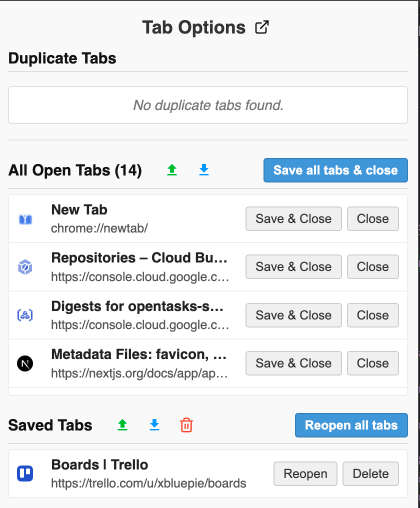

# Tab Options

[](../../releases)
[](https://chromewebstore.google.com/detail/tab-options/kafdoidjnnbjciplpkhhfjoefkpfbplj)
[](https://addons.mozilla.org/en-US/firefox/addon/tab-options-open-source/)

A lightweight browser extension that keeps your browsing session under control: instantly spot and close duplicate tabs, save sessions for later, and export/import/share your work with a single click. Works on Chrome and Firefox.

---

## Features

|            #             | Details                                                                                                                             |
| ------------------------ | ----------------------------------------------------------------------------------------------------------------------------------- |
| Duplicate-Tab Detection  | Real-time badge counter plus a toast asking whether to merge (switch & close) or keep both tabs.                                    |
| All Tabs Panel           | Popup (and optional full-screen view) listing every open tab, with buttons to **Close**, **Save & Close**, or **Save all & Close**. |
| Session Save / Restore   | One-click “Save” area. Restore/Sharing everything at once or reopen individual pages.                                               |
| ️Import, Export & Share   | Export your saved list to an HTML file; import it again on any machine.                                                             |
| Duplicate Tabs Summary   | Separate block at the top of the popup – see duplicates at a glance and close them in bulk.                                         |
| Group by Domain          | Option to group open tabs by their domain for better organization.                                                                  |
| Lightweight & Open source| -

---


---

## Installation


**For Chrome:**

1. Visit the Chrome Web Store:  
   https://chromewebstore.google.com/detail/tab-options/kafdoidjnnbjciplpkhhfjoefkpfbplj
2. Click **Add to Chrome** → **Add extension**.
3. Pin the blue “TO” icon in your toolbar for quick access (optional).

**For Firefox:**

1. Visit Firefox Add-ons:  
   https://addons.mozilla.org/en-US/firefox/addon/tab-options-open-source/
   *Alternatively, for development/manual install:*
     * Download the `.zip` or `.xpi` file from the [releases page](../../releases).
     * Open Firefox, type `about:addons` in the address bar, and press Enter.
     * Click the gear icon (Tools for all add-ons) and select "Install Add-on From File...".
     * Select the downloaded file.
2. Click **Add to Firefox** → **Add**.
3. The “TO” icon will appear in your toolbar.

---

## Quick Start

1. Open a few webpages; duplicate one to see the badge counter turn red.
2. Use:  
   • **Switch & Close** to jump to the original and close the copy.  
   • **Keep Tab** if you intentionally want duplicates.
   • **Go Back** to return to the previous page (if navigated).
3. Click the toolbar icon.
4. Use the **Close all duplicate** button in the popup to clean up multiple duplicates at once.
5. In the popup, hit **Save all tabs & close** to stash your current session.
6. Later, press **Reopen all tabs** to bring everything back.
7. Export & Import all sessions

### Preview 1

<p align="center">
  
</p>

### Preview 2

<p align="center">
  
</p>

### Preview 3

<p align="center">
  
</p>

### Export

The export feature allows you to save your lists of open or saved tabs into a HTML file. This HTML file can then be used to import the tabs back into the extension on any machine, either adding them to your saved list or opening them directly. This makes it easy to back up, share, or transfer your tab sessions.

<p align="center">
  
</p>

---


## Motivation

Having dozens of identical tabs scattered across multiple windows and profile is a pain, happens in personal machine and office machine.

---

## Development

To get started with development:

```bash
git clone git@github.com:aghontpi/Tab-Options.git
cd Tab-Options 
pnpm install
pnpm run dev:chrome # For Chrome 
pnpm run dev:firefox # For Firefox
```

**Chrome:**

1.  Open Chrome → `chrome://extensions` → Enable **Developer mode**.
2.  Click **Load unpacked** and select the `dev-build/chrome` folder.

**Firefox:**

1.  Open Firefox → `about:debugging#/runtime/this-firefox`.
2.  Click **Load Temporary Add-on...**.
3.  Navigate to the `dev-build/firefox` folder and select the `manifest.json` file.

(or)

Install with `web-ext`:

Via `pnpm`:

```bash
pnpm install -g web-ext
```

Or via Brew:

```bash
brew install web-ext
```

Then run:

```bash
cd dev-build
web-ext run
```

## Built With

- **[React](https://reactjs.org/)**: Used for building the user interface components.
- **[Parcel](https://parceljs.org/)**: Web application bundler for building the extension.
- **[Chrome Extension API](https://developer.chrome.com/docs/extensions/reference/)**: Core functionality for Chrome.
- **[Firefox WebExtensions API](https://developer.mozilla.org/en-US/docs/Mozilla/Add-ons/WebExtensions)**: Core functionality for Firefox.

---

## Folder Structure

- `src/`: Source code for the extension.
  - `components/`: Reusable React components.
  - `hooks/`: Custom React hooks.
  - `pages/`: Full-page components.
  - `popup/`: Entry point and components for the extension popup.
  - `utils/`: Utility functions and helpers.
  - `background.js`: Service worker for background tasks.
  - `content_script.js`: Script injected into web pages.
- `dev-build/`: Output directory for development builds.
- `dist/`: Output directory for production builds.
- `scripts/`: Helper scripts for building and packaging.

---

## Project Status

https://trello.com/b/lrHGzH6P/tab-options

## License

Apache License 2.0 - https://github.com/aghontpi/Tab-Options/blob/main/LICENSE

---

## Support

• File an issue → GitHub Issues tab  
• Rate on the [Chrome Web Store](https://chromewebstore.google.com/detail/tab-options/kafdoidjnnbjciplpkhhfjoefkpfbplj)
• Rate on [Firefox Add-ons](https://addons.mozilla.org/en-US/firefox/addon/tab-options-open-source/reviews/)
