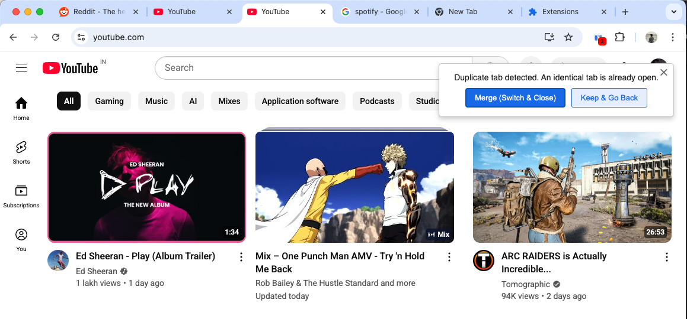
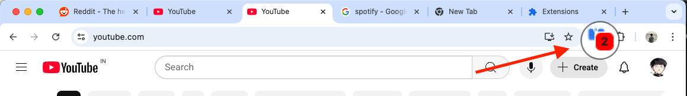
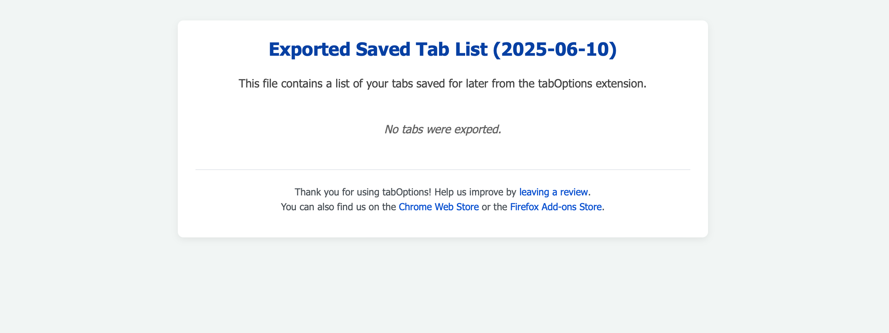

# Tab Options

[](../../releases)
[](https://chromewebstore.google.com/detail/tab-options/kafdoidjnnbjciplpkhhfjoefkpfbplj)
[](https://addons.mozilla.org/en-US/firefox/addon/tab-options-open-source/)

A lightweight browser extension that keeps your browsing session under control: instantly spot and close duplicate tabs, save sessions for later, and export/import/share your work with a single click. Works on Chrome and Firefox.

---

## Features

|            x             | Details                                                                                                                             |
| ------------------------ | ----------------------------------------------------------------------------------------------------------------------------------- |
| Duplicate-Tab Detection  | Real-time badge counter plus a toast asking whether to merge (switch & close) or keep both tabs.                                    |
| All Tabs Panel           | Popup (and optional full-screen view) listing every open tab, with buttons to **Close**, **Save & Close**, or **Save all & Close**. |
| Session Save / Restore   | One-click “Save” area. Restore/Sharing everything at once or reopen individual pages.                                               |
| ️ Import, Export & Share  | Export your saved list to an HTML file; import it again on any machine.                                                             |
| Duplicate Tabs Summary   | Separate block at the top of the popup – see duplicates at a glance and close them in bulk.                                         |
| Lightweight              | under 30kb                                                                                                                          |

---

## Installation

**For Chrome:**

1. Visit the Chrome Web Store:  
   https://chromewebstore.google.com/detail/tab-options/kafdoidjnnbjciplpkhhfjoefkpfbplj
2. Click **Add to Chrome** → **Add extension**.
3. Pin the blue “TO” icon in your toolbar for quick access (optional).

**For Firefox:**

1. Visit Firefox Add-ons:  
   https://addons.mozilla.org/en-US/firefox/addon/tab-options-open-source/
   *Alternatively, for development/manual install:*
     * Download the `.zip` or `.xpi` file from the [releases page](../../releases).
     * Open Firefox, type `about:addons` in the address bar, and press Enter.
     * Click the gear icon (Tools for all add-ons) and select "Install Add-on From File...".
     * Select the downloaded file.
2. Click **Add to Firefox** → **Add**.
3. The “TO” icon will appear in your toolbar.

---

## Quick Start

1. Open a few webpages; duplicate one to see the badge counter turn red.
2. Use:  
   • **Merge (Switch & Close)** to jump to the original and close the copy.  
   • **Keep & Go Back** if you really need two identical tabs.
3. Click the toolbar icon.
4. In the popup, hit **Save all tabs & close** to stash your current session.
5. Later, press **Reopen all tabs** to bring everything back.
6. Export & Import all sessions

### Preview 1

<p align="center">
  
</p>

### Preview 2

<p align="center">
  
</p>

### Preview 3

<p align="center">
  
</p>

### Export

<p align="center">
  
</p>

---

## Options

| Option                | Where              | Notes                                                                                              |
| --------------------- | ------------------ | -------------------------------------------------------------------------------------------------- |
| Full-screen dashboard | Popup → ↗          | Expands the popup into its own tab for large sessions.                                             |
| Export/Import/Share   | Popup bottom right | Creates a page, that can be shared with others; import merges with your existing open/ saved tabs. |

---

## Motivation

Having dozens of identical tabs scattered across multiple windows and profile is a pain, happens in personal machine and office machine.

---

## Development

To get started with development:

```bash
git clone git@github.com:aghontpi/Tab-Options.git
cd tab-options
pnpm install
pnpm run dev:chrome # For Chrome 
pnpm run dev:firefox # For Firefox
```

**Chrome:**

1.  Open Chrome → `chrome://extensions` → Enable **Developer mode**.
2.  Click **Load unpacked** and select the `dev-build/chrome` folder.

**Firefox:**

1.  Open Firefox → `about:debugging#/runtime/this-firefox`.
2.  Click **Load Temporary Add-on...**.
3.  Navigate to the `dev-build/firefox` folder and select the `manifest.json` file.

(or)

Install with `web-ext`:

Via `pnpm`:

```bash
pnpm install -g web-ext
```

Or via Brew:

```bash
brew install web-ext
```

Then run:

```bash
cd dev-build
web-ext run
```

## License

Apache License 2.0 - https://github.com/aghontpi/Tab-Options/blob/main/LICENSE

---

## Support

• File an issue → GitHub Issues tab  
• Rate on the [Chrome Web Store](https://chromewebstore.google.com/detail/tab-options/kafdoidjnnbjciplpkhhfjoefkpfbplj)
• Rate on [Firefox Add-ons](https://addons.mozilla.org/en-US/firefox/addon/tab-options-open-source/reviews/)
